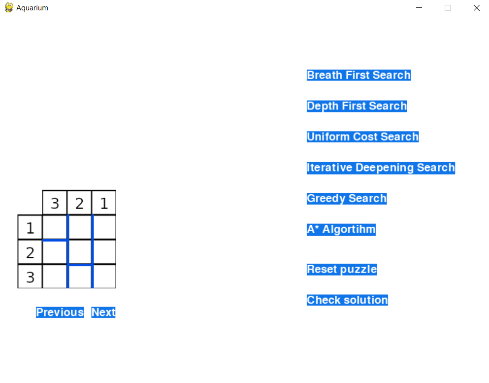

# Aquarium Puzzle

## How to run 
To run the program, you will need to have installed Python3 and Pygame.

To install Python3, go to the [website](https://www.python.org/downloads/)

To install Pygame, if you have pip (comes with Python3), you only need to run this command:
>pip install pygame

After completing the download, go to the src folder and run the following command:
>python main.py

## Playing the puzzle

The following picture represents an example puzzle:

On the left side, there is the puzzle. To fill an aquarium, press the **left mouse button**. To empty it, press the **right mouse button**.

To help with the interaction, there are several buttons. The ones of the right apply the algorithm described in its name to the puzzle, solving it. The **Reset Puzzle** button empties all the puzzzles, and the **Check solution** one checks if the current state of the puzzle is the correct one. The **Previous** and **Next** buttons change the current puzzle.

